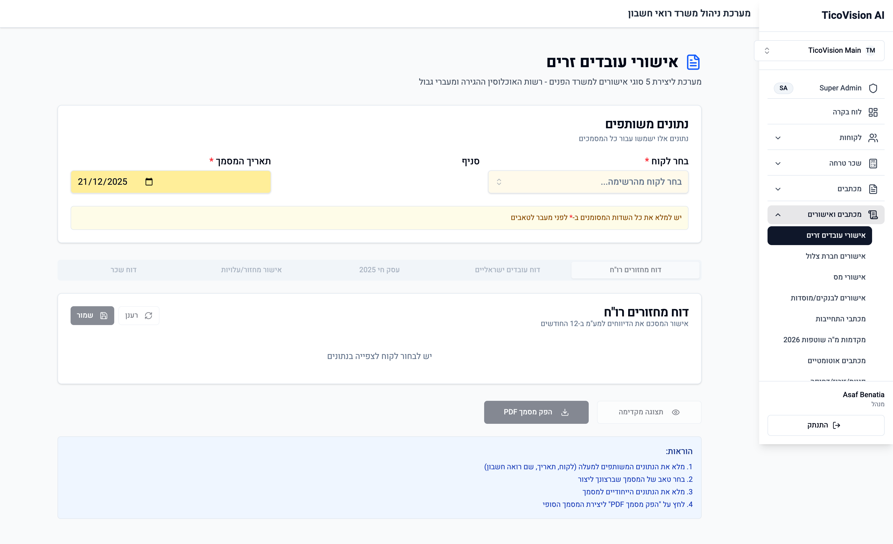
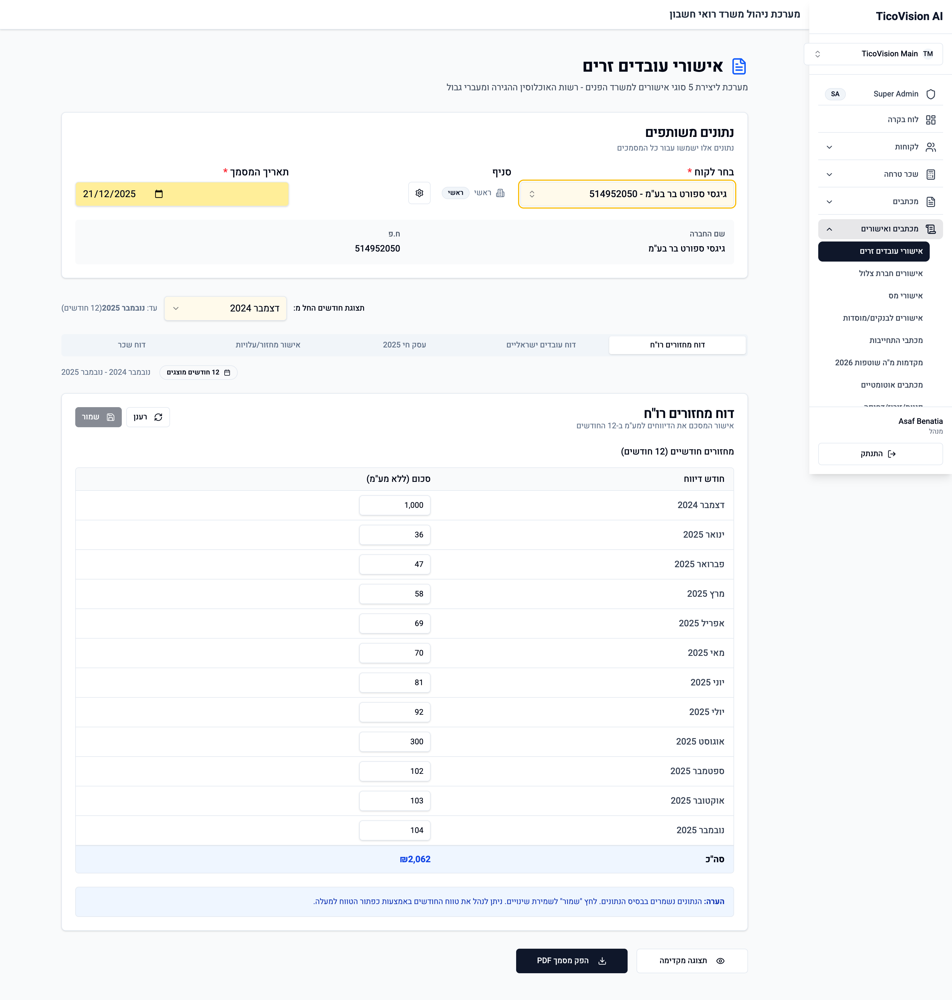
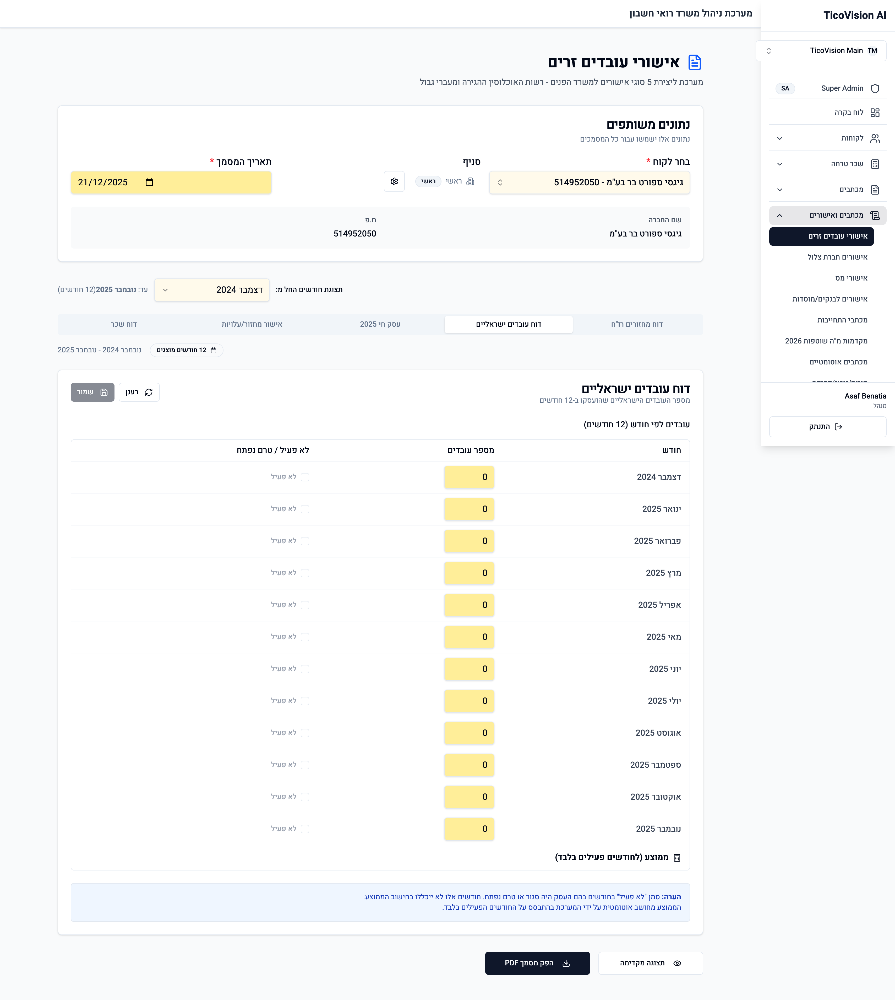
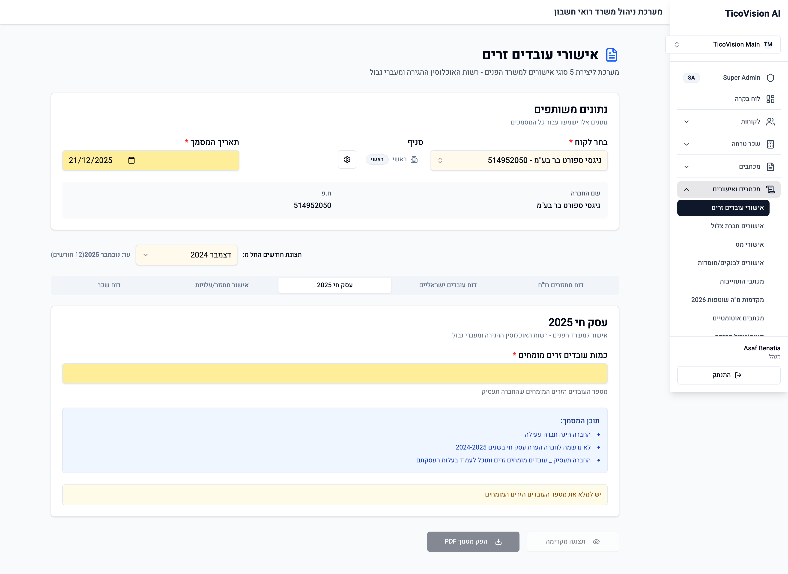
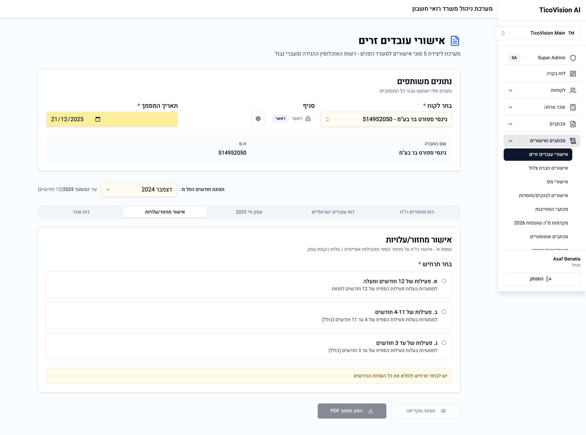
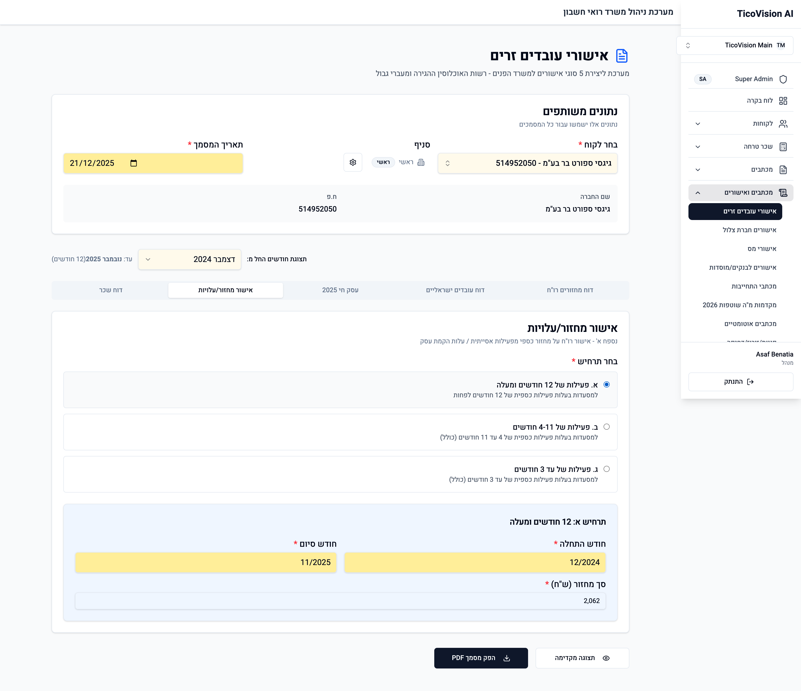
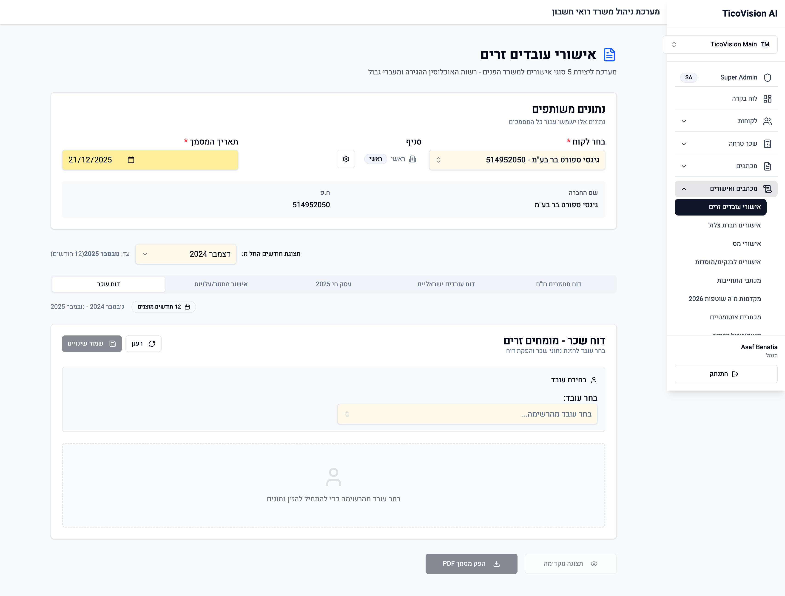
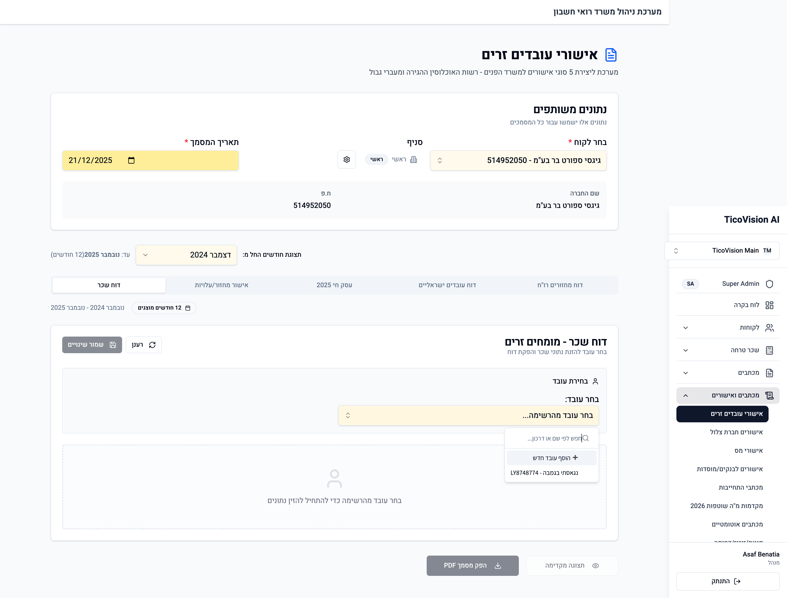
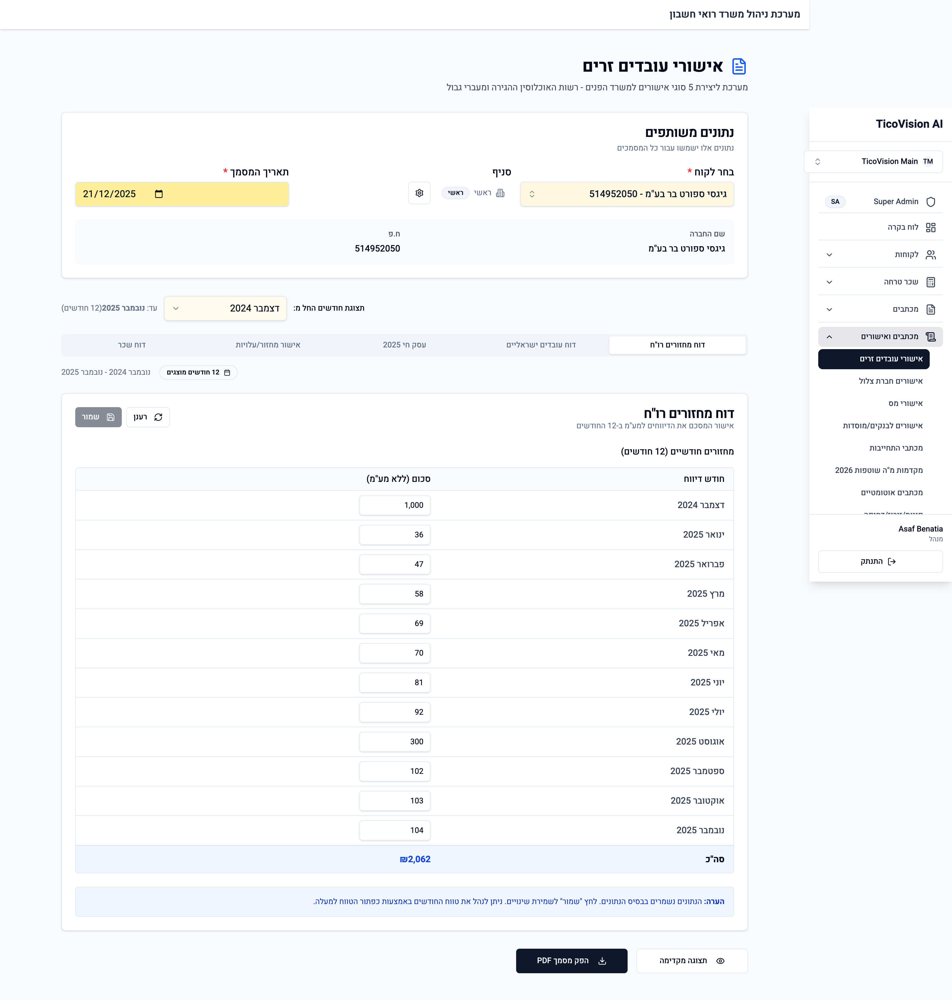
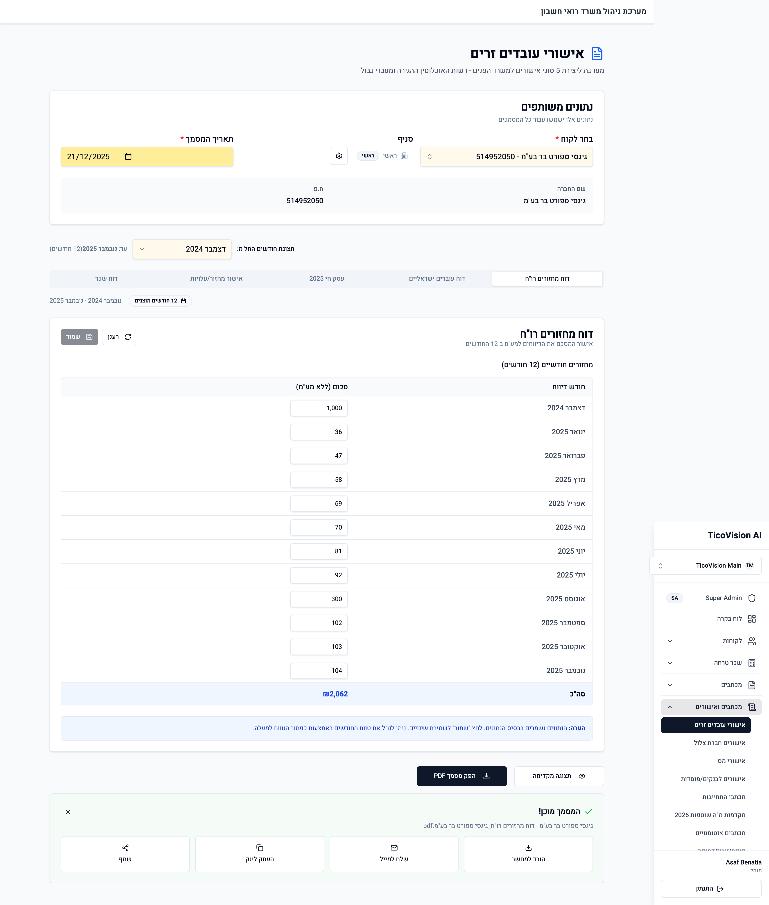

# מדריך אישורי עובדים זרים

מדריך מצולם ומפורט לשימוש במערכת הפקת אישורים למשרד הפנים - רשות האוכלוסין ההגירה ומעברי גבול.

---

## תוכן עניינים

1. [סקירה כללית](#סקירה-כללית)
2. [כניסה למודול](#כניסה-למודול)
3. [בחירת לקוח](#בחירת-לקוח)
4. [הנתונים המשותפים](#הנתונים-המשותפים)
5. [סוגי האישורים](#סוגי-האישורים)
   - [דוח מחזורים רו"ח](#דוח-מחזורים-רוח)
   - [דוח עובדים ישראליים](#דוח-עובדים-ישראליים)
   - [עסק חי 2025](#עסק-חי-2025)
   - [אישור מחזור/עלויות](#אישור-מחזורעלויות)
   - [דוח שכר](#דוח-שכר)
6. [הפקת מסמך PDF](#הפקת-מסמך-pdf)
7. [שיתוף ושליחה](#שיתוף-ושליחה)

---

## סקירה כללית

מודול אישורי עובדים זרים מאפשר הפקת 5 סוגי אישורים נדרשים לבקשות היתר עבודה לעובדים זרים מומחים (בעיקר טבחים אסייתיים למסעדות).

המערכת שומרת את הנתונים בבסיס הנתונים, כך שלא צריך להזין אותם מחדש בכל פעם.

---

## כניסה למודול

**איך להגיע:**
1. התחברו למערכת TicoVision
2. בתפריט הצד, לחצו על **"מכתבים ואישורים"**
3. בחרו **"אישורי עובדים זרים"**

בדף ההתחלתי תראו:
- אזור **נתונים משותפים** - פרטים שישמשו לכל המסמכים
- 5 טאבים לסוגי האישורים השונים (מושבתים עד לבחירת לקוח)
- הוראות שימוש בתחתית המסך

---

## בחירת לקוח

### שלב 1: פתיחת בוחר הלקוחות

לחצו על השדה **"בחר לקוח"** כדי לפתוח את רשימת הלקוחות.

### שלב 2: חיפוש לקוח

הקלידו את שם הלקוח (או חלק ממנו) בשדה החיפוש. המערכת תסנן את הרשימה בזמן אמת.

**דוגמה:** חיפוש "גיגסי" יציג את כל הלקוחות שבשמם מופיע "גיגסי".

### שלב 3: בחירת הלקוח

לחצו על הלקוח הרצוי מהרשימה. במקרה שלנו: **"גיגסי ספורט בר בע"מ - 514952050"**

---

## הנתונים המשותפים

לאחר בחירת הלקוח, המערכת תמלא אוטומטית:

| שדה | תיאור | מקור |
|-----|-------|------|
| **שם החברה** | שם הלקוח המלא | נטען מכרטיס הלקוח |
| **ח.פ** | מספר חברה / ע.מ | נטען מכרטיס הלקוח |
| **סניף** | הסניף הפעיל | ברירת מחדל: "ראשי" |
| **תאריך המסמך** | תאריך הפקת האישור | ברירת מחדל: היום |

### בחירת טווח חודשים

עבור הטאבים שמציגים נתונים חודשיים (מחזורים, עובדים ישראליים, דוח שכר), ניתן לבחור את טווח ה-12 חודשים לתצוגה.

**שדות טווח:**
- **תצוגת חודשים החל מ:** - החודש הראשון בטווח
- **עד:** - החודש האחרון (מחושב אוטומטית - 12 חודשים)

---

## סוגי האישורים

### דוח מחזורים רו"ח

**מטרת המסמך:** אישור רואה חשבון על סך הדיווחים למע"מ ב-12 החודשים האחרונים.

**נתונים להזנה:**

| חודש | סכום (ללא מע"מ) |
|------|----------------|
| דצמבר 2024 | הזינו את סכום המחזור |
| ינואר 2025 | הזינו את סכום המחזור |
| ... | ... |
| נובמבר 2025 | הזינו את סכום המחזור |

**סה"כ:** מחושב אוטומטית על ידי המערכת.

**טיפים:**
- הנתונים נשמרים אוטומטית בבסיס הנתונים
- לחצו **"שמור"** לאחר עריכה ידנית
- לחצו **"רענן"** לטעינה מחדש מבסיס הנתונים

---

### דוח עובדים ישראליים

**מטרת המסמך:** אישור על מספר העובדים הישראליים שהועסקו ב-12 חודשים.

**נתונים להזנה:**

לכל חודש:
- **מספר עובדים** - כמות העובדים הישראליים שהועסקו
- **לא פעיל** - סמנו אם העסק היה סגור או טרם נפתח באותו חודש

**חישוב ממוצע:**
המערכת מחשבת את ממוצע העובדים רק על בסיס החודשים הפעילים. חודשים המסומנים כ"לא פעיל" לא נכללים בחישוב.

---

### עסק חי 2025

**מטרת המסמך:** אישור למשרד הפנים שהחברה היא חברה פעילה ואין לה הערת עסק חי.

**נתונים להזנה:**

| שדה | תיאור | חובה |
|-----|-------|------|
| **כמות עובדים זרים מומחים** | מספר העובדים שהחברה תעסיק | כן |

**תוכן המסמך (נוצר אוטומטית):**
- החברה הינה חברה פעילה
- לא נרשמה לחברה הערת עסק חי בשנים 2024-2025
- החברה תעסיק X עובדים מומחים זרים ותוכל לעמוד בעלות העסקתם

---

### אישור מחזור/עלויות

**מטרת המסמך:** נספח א' - אישור רו"ח על מחזור כספי מפעילות אסייתית / עלות הקמת עסק.

**בחירת תרחיש:**

יש לבחור את התרחיש המתאים לפי תקופת הפעילות של העסק:

| תרחיש | תיאור | מתי לבחור |
|-------|-------|-----------|
| **א'** | פעילות של 12 חודשים ומעלה | למסעדות ותיקות עם פעילות של שנה לפחות |
| **ב'** | פעילות של 4-11 חודשים | למסעדות חדשות יחסית |
| **ג'** | פעילות של עד 3 חודשים | למסעדות חדשות מאוד או בהקמה |

**לאחר בחירת תרחיש א':**

| שדה | תיאור | מקור |
|-----|-------|------|
| **חודש התחלה** | תחילת התקופה (MM/YYYY) | מועתק מטאב מחזורים |
| **חודש סיום** | סיום התקופה (MM/YYYY) | מועתק מטאב מחזורים |
| **סך מחזור (ש"ח)** | סה"כ המחזור בתקופה | מועתק מטאב מחזורים |

---

### דוח שכר

**מטרת המסמך:** טבלת דוח שכר 12 חודשי עבודה לעובד זר מומחה ספציפי.

**שלב 1: בחירת עובד**

לחצו על **"בחר עובד"** ובחרו את העובד הזר עבורו תרצו להפיק דוח שכר.

> **הערה:** אם אין עובדים ברשימה, יש להוסיף אותם דרך ניהול העובדים בכרטיס הלקוח.

**שלב 2: הזנת נתוני שכר**

לכל חודש יש למלא:
- שכר ברוטו
- הפרשות סוציאליות
- סה"כ עלות מעסיק

---

## הפקת מסמך PDF

### שלב 1: וידוא נתונים

לפני ההפקה, ודאו ש:
- כל השדות החובה מולאו (מסומנים ב-*)
- הנתונים נכונים ומעודכנים
- הטאב הנכון נבחר

### שלב 2: לחיצה על "הפק מסמך PDF"

לחצו על הכפתור **"הפק מסמך PDF"**. המערכת תציג:
- הודעת "יוצר מסמך..."
- אנימציית טעינה

**זמן הפקה:** בדרך כלל 5-15 שניות.

---

## שיתוף ושליחה

לאחר הפקת המסמך, יופיע פאנל השיתוף עם האפשרויות הבאות:

| כפתור | פעולה |
|-------|-------|
| **הורד למחשב** | שמירת ה-PDF במחשב המקומי |
| **שלח למייל** | שליחת המסמך באימייל ללקוח או לגורם רלוונטי |
| **העתק לינק** | העתקת קישור ישיר למסמך |
| **שתף** | שיתוף דרך אמצעים נוספים |

**שם הקובץ:** נוצר אוטומטית בפורמט:
`[סוג המסמך]_[שם החברה].pdf`

**דוגמה:** `דוח מחזורים רו"ח_גיגסי ספורט בר בע"מ.pdf`

---

## שמירה אוטומטית

כל המסמכים שמופקים נשמרים אוטומטית ב:
- **מנהל הקבצים** של הלקוח
- קטגוריה: **"אישורי עובדים זרים"**

ניתן לגשת למסמכים שהופקו בעבר דרך מנהל הקבצים של הלקוח.

---

## טיפים ושאלות נפוצות

### מתי להשתמש בכל סוג אישור?

| אישור | מתי נדרש |
|-------|----------|
| דוח מחזורים רו"ח | תמיד - חובה בכל בקשה |
| דוח עובדים ישראליים | תמיד - חובה בכל בקשה |
| עסק חי | תמיד - חובה בכל בקשה |
| אישור מחזור/עלויות | לפי דרישה - נספח א' |
| דוח שכר | לכל עובד זר - פר עובד |

### מה לעשות אם הנתונים לא נטענים?

1. לחצו על כפתור **"רענן"**
2. ודאו שיש חיבור אינטרנט תקין
3. נסו לרענן את הדף (F5)
4. אם הבעיה נמשכת, פנו לתמיכה

### איך מעדכנים נתונים היסטוריים?

ניתן לערוך כל שדה ישירות בטבלה. לאחר העריכה, לחצו **"שמור"** לשמירת השינויים.

---

## תמיכה

לשאלות נוספות או תמיכה טכנית, פנו ל:
- מייל: support@ticovision.co.il
- טלפון: 03-XXX-XXXX

---

*מדריך זה עודכן לאחרונה: דצמבר 2025*
